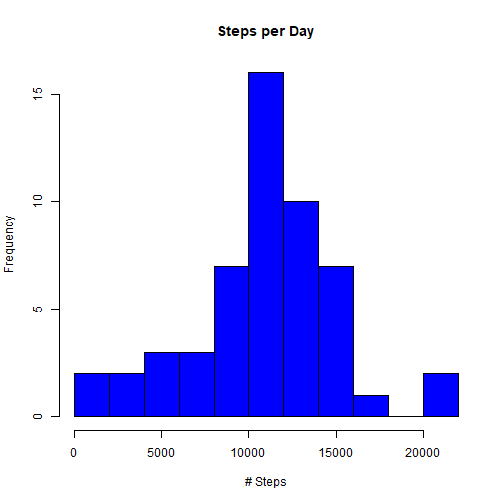
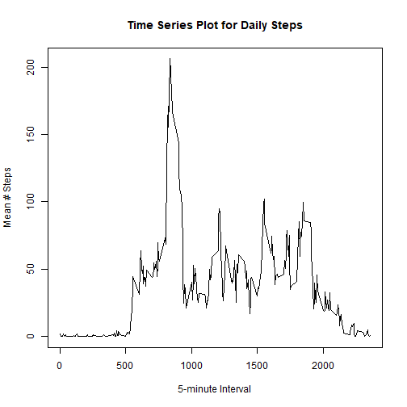
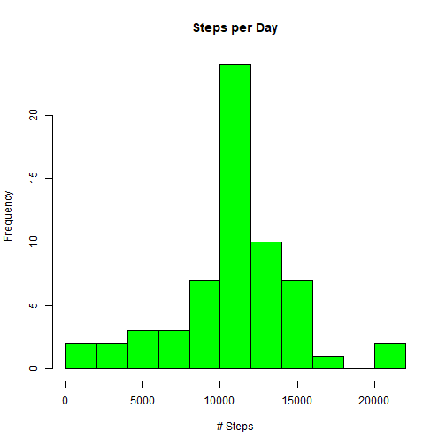
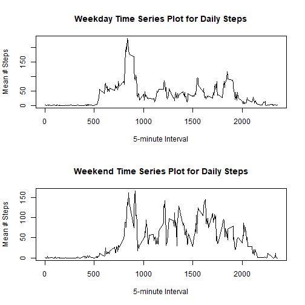

This project assumes your active directory is set to a clone of the (Github repo for this assignment)[http://github.com/rdpeng/RepData_PeerAssessment1], which contains the (activity monitoring data)[https://d396qusza40orc.cloudfront.net/repdata%2Fdata%2Factivity.zip] used for this assignment.


## Loading and preprocessing the data

First, we load the data into R. Unzip the compressed file containing our data and then use read.csv to load the data into R. 


```r
unzip("activity.csv")
```

```
## Warning in unzip("activity.csv"): error 1 in extracting from zip file
```

```r
actdata <- read.csv("activity.csv")
```


```r
library(tidyr)
```

This activity data contains 17568 observations for 3 variables: steps, date, and interval. However, some of these observations are incomplete - no step data is recorded. For the first part of our analysis, we create a version of the data with the NA's removed. 

```r
dim(actdata)
```

```
## [1] 17568     3
```

```r
head(actdata)
```

```
##   steps       date interval
## 1    NA 2012-10-01        0
## 2    NA 2012-10-01        5
## 3    NA 2012-10-01       10
## 4    NA 2012-10-01       15
## 5    NA 2012-10-01       20
## 6    NA 2012-10-01       25
```

```r
sum(is.na(actdata))
```

```
## [1] 2304
```

```r
actclean <- na.omit(actdata)
dim(actclean)
```

```
## [1] 15264     3
```

```r
head(actclean)
```

```
##     steps       date interval
## 289     0 2012-10-02        0
## 290     0 2012-10-02        5
## 291     0 2012-10-02       10
## 292     0 2012-10-02       15
## 293     0 2012-10-02       20
## 294     0 2012-10-02       25
```

```r
sum(is.na(actclean))
```

```
## [1] 0
```

## What is mean total number of steps taken per day?

To calculate the mean total number of steps per day, first we calculate the number of steps per day with the aggregate function, then take the mean. 


```r
actsum <- aggregate(actclean$steps,by=list("date"=actclean$date),FUN=sum)
names(actsum)=c("date","steps")

hist(actsum$steps,breaks=10,col="blue",main="Steps per Day",xlab="# Steps",ylab="Frequency")
```



```r
mean(actsum$steps)
```

```
## [1] 10766.19
```

```r
median(actsum$steps)
```

```
## [1] 10765
```

We can see that the mean number of steps per day in this dataset is 10766.19 steps, and that the median number of steps per day in this dataset is 10765 steps.

## What is the average daily activity pattern?

Here we aggregate the data in a different way - instead of summing steps per day, here we take the average (mean) of steps for each 5-minute interval over the course of the days. We plot this as a time series. 

```r
actint <- aggregate(actclean$steps,by=list("interval"=actclean$interval),FUN=mean)
names(actint)<-c("interval","steps")
plot(actint,type="l",main="Time Series Plot for Daily Steps",ylab="Mean # Steps",xlab="5-minute Interval")
```



```r
max(actint$x)
```

```
## Warning in max(actint$x): no non-missing arguments to max; returning -Inf
```

```
## [1] -Inf
```

```r
actint[actint$steps==max(actint$steps),1]
```

```
## [1] 835
```

From our calculations above, we also see that the highest mean number of steps in a 5 minute interval is about 206 steps, and that this occurs during the 835th 5-minute interval of the day.

## Imputing missing values
As mentioned at the beginning, there are some missing values in our dataset. As you can see from the calculation below, there are 2304 values in our activity data that are missing (NA). We will replace this missing data by filling it in with the mean value that we just previously calculated for the corresponding 5-minute intervals.

```r
sum(is.na(actdata))
```

```
## [1] 2304
```

```r
actfill <- actdata
nasteps <- is.na(actdata$steps)
for(i in 1:length(nasteps)) {if(nasteps[i])actfill[i,1]<-actint[actint$interval==actdata[i,3],2]}
```

To see the effects of our modification, let's create a new histogram of total steps per day with this modified data and also calculate mean and median total steps per day.


```r
actfillsum <- aggregate(actfill$steps,by=list("date"=actfill$date),FUN=sum)
names(actfillsum)=c("date","steps")
hist(actfillsum$steps,breaks=10,col="green",main="Steps per Day",xlab="# Steps",ylab="Frequency")
```



```r
mean(actfillsum$steps)
```

```
## [1] 10766.19
```

```r
median(actfillsum$steps)
```

```
## [1] 10766.19
```

We can see that the general shape of the histogram from before is largely maintained. Since we only replaced NA values with the existing mean, the new mean for total daily steps is unchanged (10766.19 steps), while the median has been shifted slightly to be equal to the mean.

## Are there differences in activity patterns between weekdays and weekends?

To compare whether there is a difference between activity patterns on weekdays and weekends, we will use the weekdays function to populate a new variable in our filled in dataset - weekdayType, for which the value is either "weekday" or "weekend". Then we can create separate time series plots based on the five minute intervals as before to compare weekday and weekend data.


```r
actfill$weekday <- weekdays(as.Date(actfill$date))
for(i in 1:nrow(actfill)) 
{ifelse(actfill[i,4] %in% c("Saturday","Sunday"),actfill[i,5]<-"Weekend",actfill[i,5]<-"Weekday")}

actweekday <- actfill[actfill$V5=="Weekday",]
actweekend <- actfill[actfill$V5=="Weekend",]

actweekday <- aggregate(actweekday$steps,by=list("interval"=actweekday$interval),FUN=mean)
actweekend <- aggregate(actweekend$steps,by=list("interval"=actweekend$interval),FUN=mean)

par(mfrow=c(2,1))
plot(actweekday,type="l",main="Weekday Time Series Plot for Daily Steps",ylab="Mean # Steps",xlab="5-minute Interval")
plot(actweekend,type="l",main="Weekend Time Series Plot for Daily Steps",ylab="Mean # Steps",xlab="5-minute Interval")
```



```r
mean(actweekday$x)
```

```
## [1] 35.61058
```

```r
mean(actweekend$x)
```

```
## [1] 42.3664
```

We can see that there is a higher mean number of steps overall on the weekend. This is supported by our graphs, which show elevated activity, especially between intervals 1000 and 2000.

